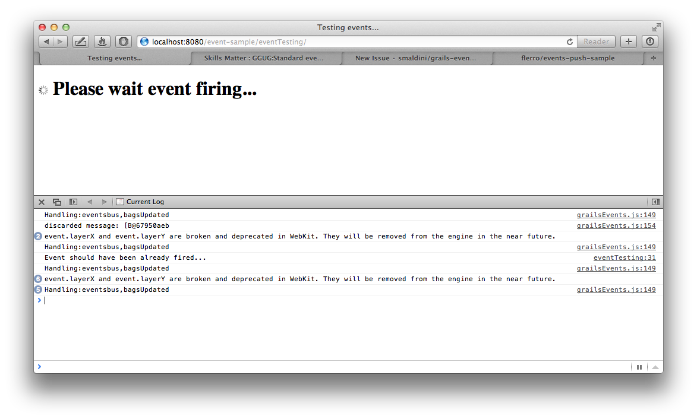

events-push-sample
==================

This is a simple grails project created from scratch depending on:

	- grails-platform-core 1.0.M3
	- grails-events-push 1.0.M2-SNAPSHOT

Custom event binding on the browser does not seem to work as advertised :)

Reproducing the issue
---------------------

0. Add at `grailsEvents.js:149` (in the _events-push_ plugin) to log message routed to the browser  

		console.log('Handling message:' + response.request.headers.topics);

1. Open the web browser and its javascript console

2. Run the app and visit http://localhost:8080/event-sample/eventTesting/ 

   The view `eventTesting/index.gsp` binds the _bagsUpdated_ topic:
   	
        try {
             var grailsEvents = new grails.Events("${createLink(uri:'')}",{transport:"sse"});
             grailsEvents.on('bagsUpdated', function(data){
                 ...
             });
        } catch (error) {
            console.log("ERROR: " + error.toString());
        }

   and triggers via AJAX

 		$(function(){
	        	// Call controller method that emits event when its done
	        	$.ajax({
	        		url: "${createLink(action:'updateBags')}",	
	    		...

    the controller method firing the _bagsUpdated_ event

		package sample

		class EventTestingController {
			...

		    def updateBags(){
		    	Thread.sleep(5000)
		    	event for:'browser', topic: 'bagsUpdated'
		    	render "OK"
		    }
		}

3. Events get routed but the callback does not fire 

	
   
   Moreover first call looks like it has an object in the response body (see. 'discarding message:...')

## Test environment

Grails 2.1.0, Safari 6, Mac OSX 10.7